## The BrainGlobe Initiative
::: {.incremental}
- Background
- Existing tools
- brainglobe-atlasapi V3
- Future directions
:::

# The BrainGlobe Initiative

## BrainGlobe Initiative {.smaller}

::: {.columns}
::: {.column width="55%"}
Established 2020 with three aims:

:::{.incremental}
1. Develop general-purpose tools to help others build interoperable software for computational neuroanatomy.
2. Develop specialist software for specific analysis and visualisation needs.
3. Reduce barriers of entry, and facilitate the building of an ecosystem of computational neuroanatomy tools.
:::

:::
::: {.column width="45%"}
{.nostretch width="90%"}
:::
:::

## BrainGlobe Initiative
::: {.columns style="text-align: center; font-size: 0.75em;"}
::: {.column .fragment width="50%"}
<br/>

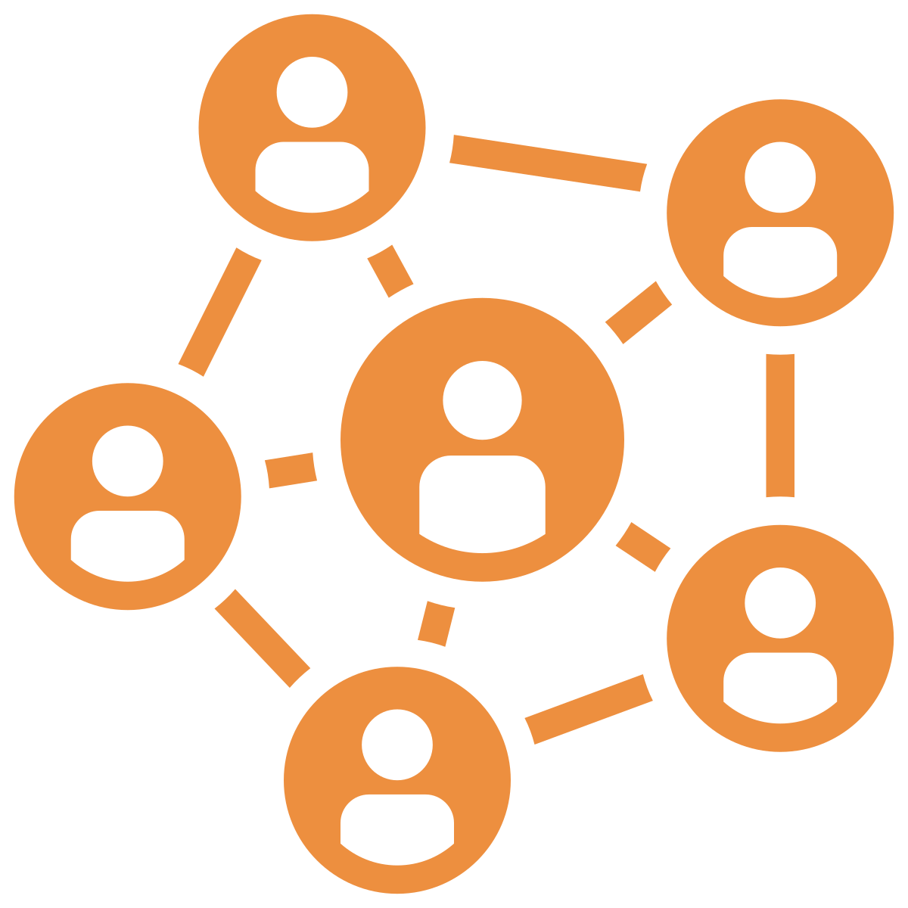{.nostretch width="60%"}

Open source and community driven
:::
::: {.column .fragment width="50%"}
<br/>

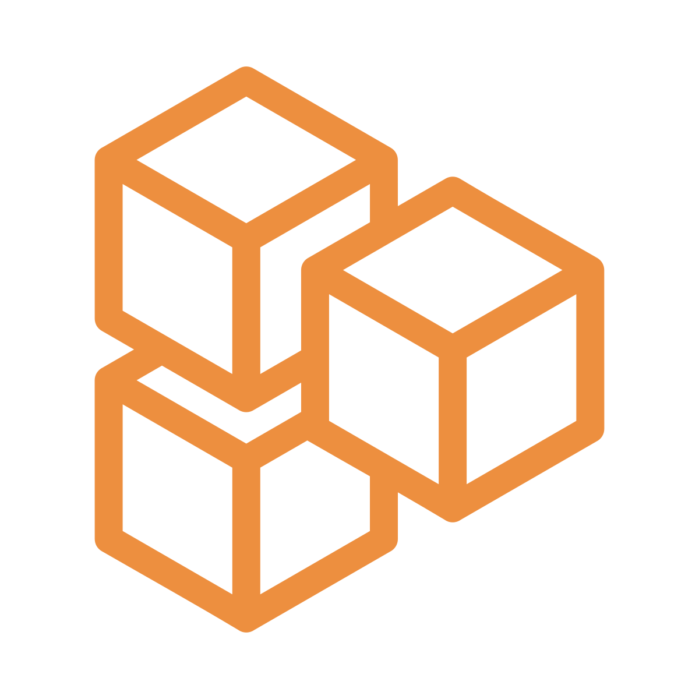{.nostretch width="60%"}

Modular tools that work together
:::
:::

## BrainGlobe Initiative

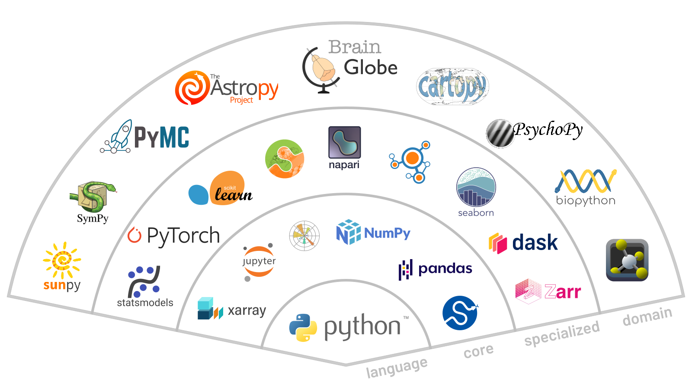{.absolute .nostretch top="20%" left="10%" width="80%"}

## BrainGlobe atlases

Problem - the data analysis tools are fragmented

::: incremental
-   Model species
-   Imaging modality
-   Anatomical focus
-   Developmental stage
:::

::: footer
[Claudi, F. et al. (2020) “BrainGlobe Atlas API: a common interface for neuroanatomical atlases” JOSS, v5(54), 2668](https://doi.org/10.21105/joss.02668)
:::

## BrainGlobe atlases

### [brainglobe-atlasapi](https://github.com/brainglobe/brainglobe-atlasapi)

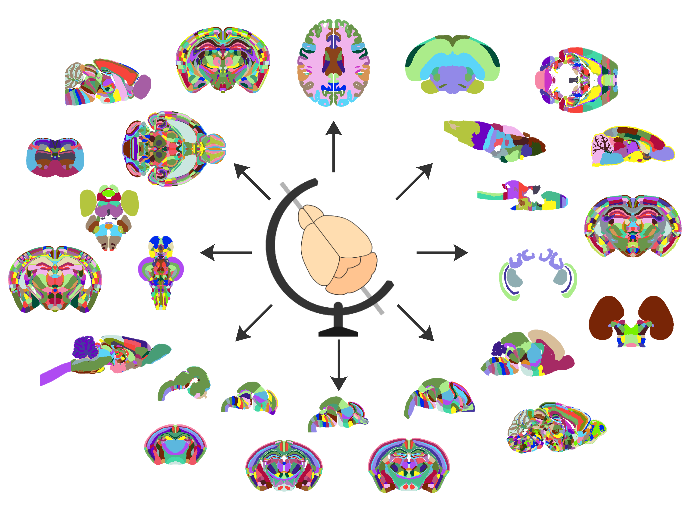{fig-align="center" .nostretch width="65%"}

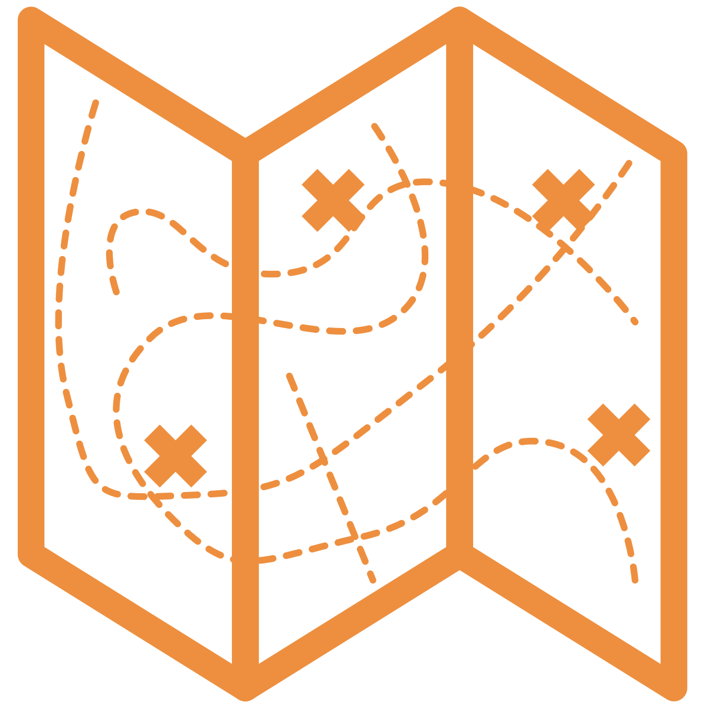{.absolute .nostretch top="4%" width="10%" right="0%"}

::: footer
[Claudi, F. et al. (2020) “BrainGlobe Atlas API: a common interface for neuroanatomical atlases” JOSS, v5(54), 2668](https://doi.org/10.21105/joss.02668)
:::

::: notes
-   Data preservation
-   Central point to BrainGlobe
:::

## BrainGlobe atlases

::::: columns
::: {.column .fragment width="50%" style="text-align: center; font-size: 0.7em;"}
<br/>

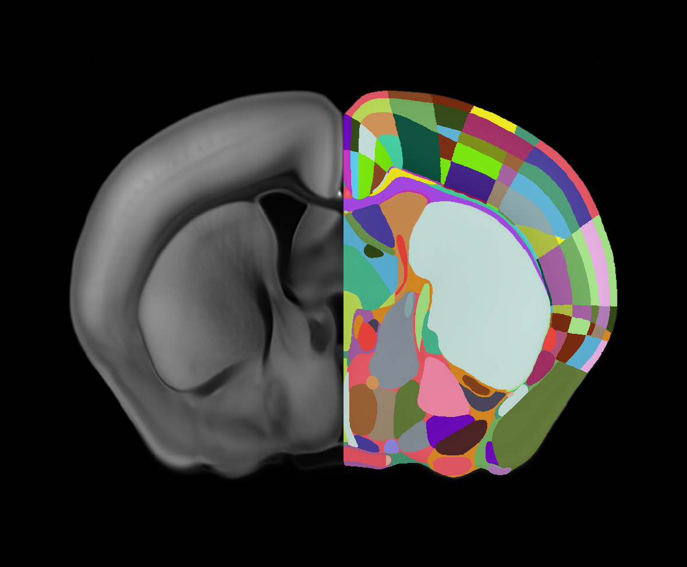{.nostretch width="80%"} 

Allen Mouse Brain CCF

::: {style="font-size: 0.5em;"}
Based on serial two-photon tomography
:::

:::

::: {.column .fragment width="50%" style="text-align: center; font-size: 0.7em;"}
<br/>

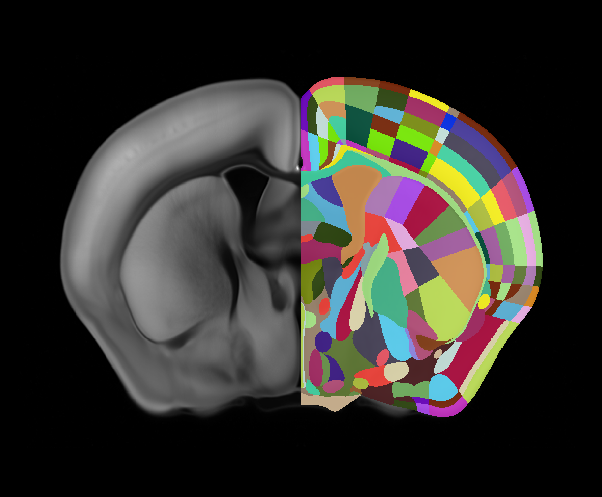{.nostretch width="80%"} 

Enhanced and Unified Mouse Brain Atlas

::: {style="font-size: 0.5em;"}
Based on serial two-photon tomography
:::

:::
:::::

{.absolute .nostretch top="4%" width="10%" right="0%"}

::: footer
[Claudi, F. et al. (2020) “BrainGlobe Atlas API: a common interface for neuroanatomical atlases” JOSS, v5(54), 2668](https://doi.org/10.21105/joss.02668)
:::

::: {.notes}
Kim mouse atlas - incorporates Paxinos atlas, with extra delineations in the striatum based on functional data.
:::

## BrainGlobe atlases

::::::: columns
:::: {.column .fragment width="50%" style="text-align: center; font-size: 0.7em;"}
<br/>

{.nostretch width="80%"}

Allen Mouse Brain CCF

::: {style="font-size: 0.5em;"}
Based on serial two-photon tomography
:::
::::

:::: {.column .fragment width="50%" style="text-align: center; font-size: 0.7em;"}
<br/>

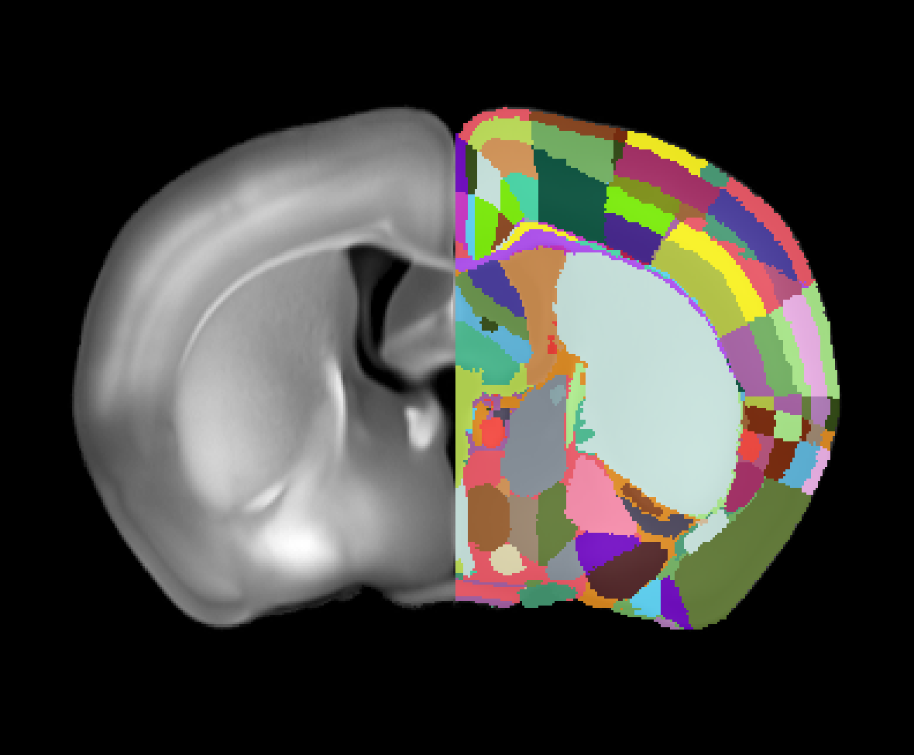{.nostretch width="80%"}

Gubra Multimodal 3D Mouse Brain Atlas

::: {style="font-size: 0.5em;"}
Based on light-sheet fluorescence microscopy
:::
::::
:::::::

{.absolute .nostretch top="4%" width="10%" right="0%"}

::: footer
[Claudi, F. et al. (2020) “BrainGlobe Atlas API: a common interface for neuroanatomical atlases” JOSS, v5(54), 2668](https://doi.org/10.21105/joss.02668)
:::

## BrainGlobe atlases

::: {.fragment .absolute top="8%" left="5%" width="35%" style="font-size: 0.6em; text-align: center;"}
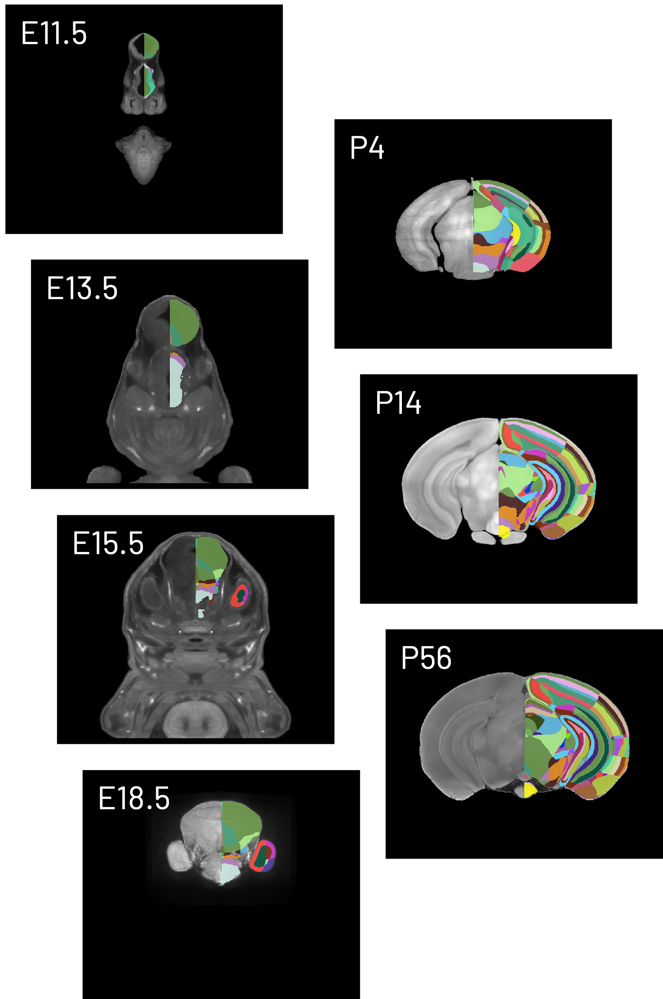{.nostretch}
DevCCF
:::

::: {.fragment .absolute top="23%" left="50%" width="40%" style="font-size: 0.6em; text-align: center;"}
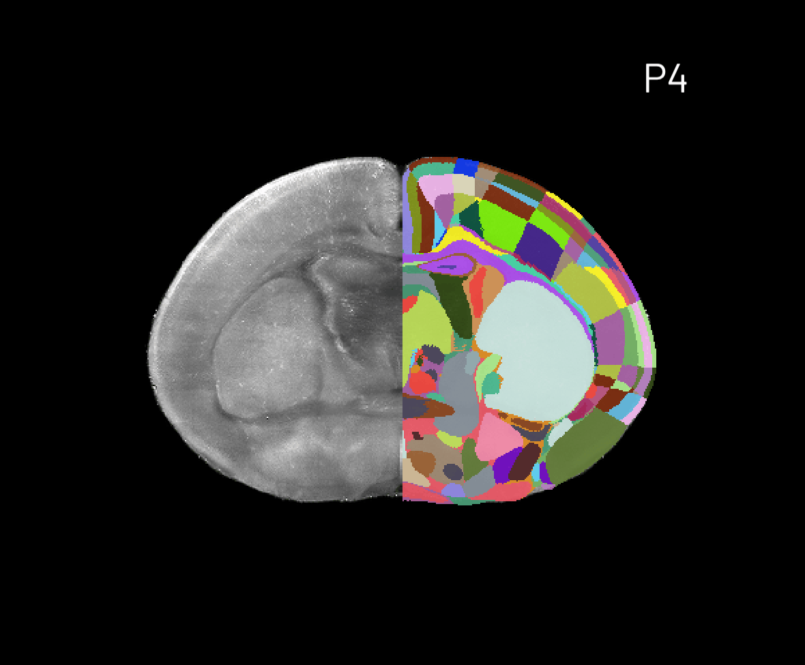{.nostretch}
Developmental Mouse Brain Atlas
:::

{.absolute top="4%" width="10%" right="0%"}

::: footer
[Claudi, F. et al. (2020) “BrainGlobe Atlas API: a common interface for neuroanatomical atlases” JOSS, v5(54), 2668](https://doi.org/10.21105/joss.02668)
:::

## BrainGlobe atlases
::: {.fragment}
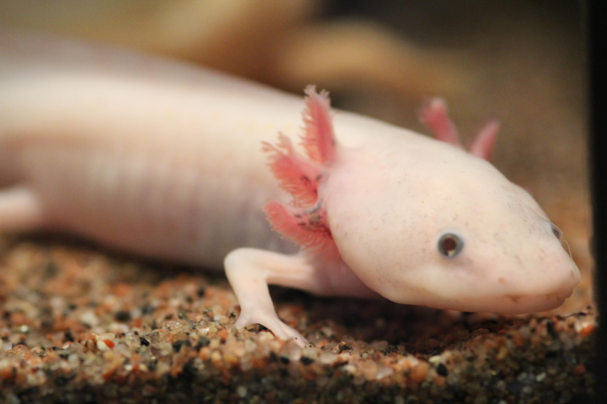{.absolute .nostretch top="15%" left="7.5%" height="35%"}

:::: {.absolute top="50%" left="0%" width="50%" style="font-size: 0.7em; text-align: center;"}
Axolotl (Ambystoma mexicanum)
::::
:::

::: {.fragment}
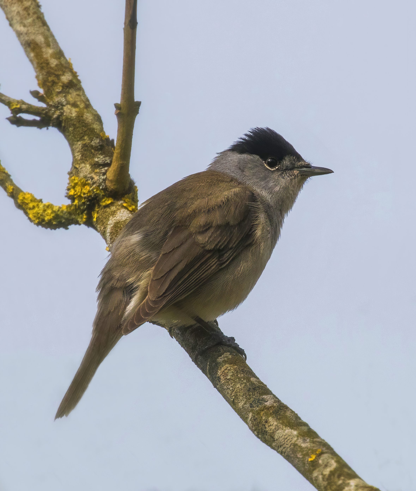{.absolute .nostretch top="15%" right="15%" height="35%"}

:::: {.absolute top="50%" right="0%" width="50%" style="font-size: 0.7em; text-align: center;"}
Eurasian Blackcap (Sylvia atricapilla)
::::
:::

::: {.fragment}
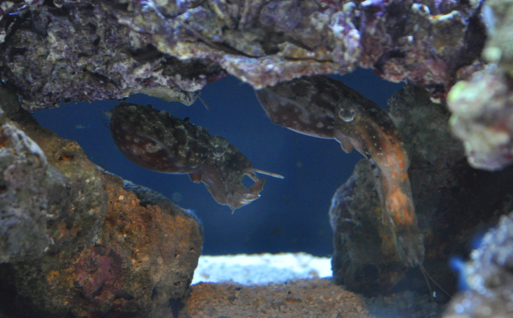{.absolute .nostretch top="58%" right="6.5%" height="35%"}

:::: {.absolute top="93%" right="0%" width="50%" style="font-size: 0.7em; text-align: center;"}
Dwarf Cuttlefish (Sepia bandensis)
::::
:::

::: {.fragment}
:::: {style="background: transparent; border: 3px dashed #ffffff; padding: 16px; border-radius: 4px; margin: 0px; position: absolute; width: 9%; height: 7%; top: 66%; right: 13%"}
::::
:::: {style="background: transparent; border: 3px dashed #ffffff; padding: 16px; border-radius: 4px; margin: 0px; position: absolute; width: 9%; height: 9%; top: 69%; right: 24%"}
::::
:::

::: {.fragment}
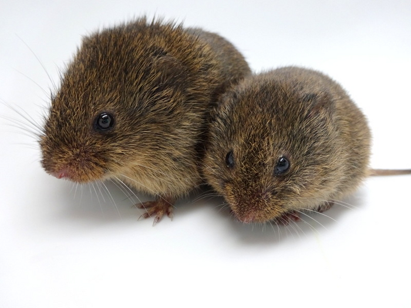{.absolute .nostretch top="58%" left="9%" height="35%"}

:::: {.absolute top="93%" left="0%" width="50%" style="font-size: 0.7em; text-align: center;"}
Prairie Vole (Microtus ochrogaster)
::::
:::

{.absolute top="4%" width="10%" right="0%"}

::: footer
[Claudi, F. et al. (2020) “BrainGlobe Atlas API: a common interface for neuroanatomical atlases” JOSS, v5(54), 2668](https://doi.org/10.21105/joss.02668)
:::

## Whole-brain registration

### [`brainreg`](https://github.com/brainglobe/brainreg)

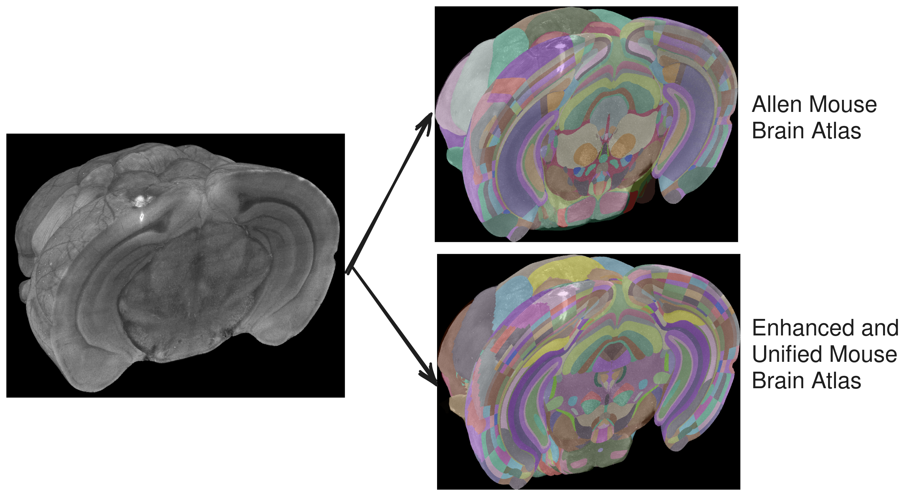{.absolute .nostretch top="20%" width="90%" left="5%"}

{.absolute .nostretch top="4%" width="10%" right="0%"}

::: {style="background: #ffffff; width: 15%; height: 65%; margin: 0px; position: absolute; top: 23%; right: 6%"}
:::

::: {.absolute top="32%" left="79%" style="font-size: 0.7em;"}
Allen Mouse<br/>
Brain Atlas
:::

::: {.absolute top="65%" left="79%" style="font-size: 0.7em;"}
Enhanced and<br/>
Unified Mouse<br/>
Brain Atlas
:::

::: footer
[Tyson, A. L. et al. (2022) “Accurate determination of marker location within whole-brain microscopy images” Sci Rep, 12, 867](https://doi.org/10.1038/s41598-021-04676-9)
:::

## Spatial analysis

### [`brainglobe-segmentation`](https://github.com/brainglobe/brainglobe-segmentation)

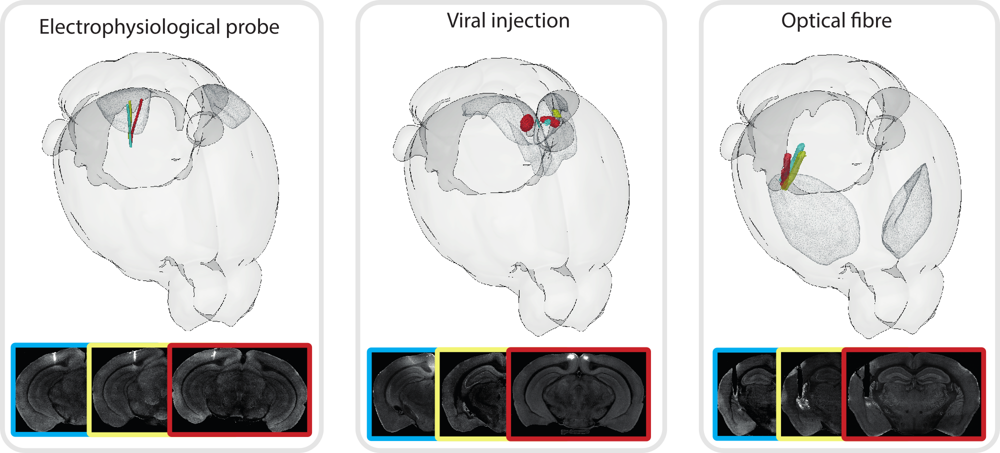{.nostretch fig-align="center" width="90%"}

{.absolute .nostretch top="4%" width="10%" right="0%"}

::: footer
[Tyson, A. L., et al. (2022) “Accurate determination of marker location within whole-brain microscopy images” Scientific Reports, 12, 867](https://doi.org/10.1038/s41598-021-04676-9)
:::

## 3D cell detection

### [`cellfinder`](https://github.com/brainglobe/cellfinder)

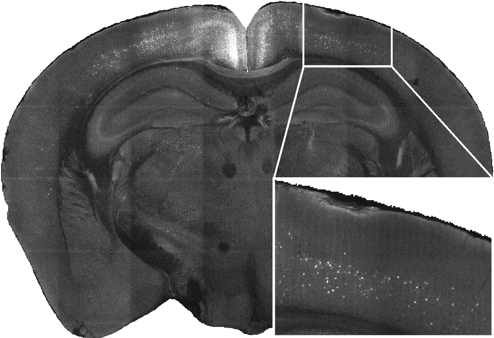{.nostretch fig-align="center" width="70%"}

{.absolute .nostretch top="4%" width="10%" right="0%"}

::: footer
[Tyson, A. L. et al. (2021) “A deep learning algorithm for 3D cell detection in whole mouse brain image datasets" PLoS Comp Biol 17(5): e1009074.](https://doi.org/10.1371/journal.pcbi.1009074)
:::

## 3D cell detection

### [`cellfinder`](https://github.com/brainglobe/cellfinder)

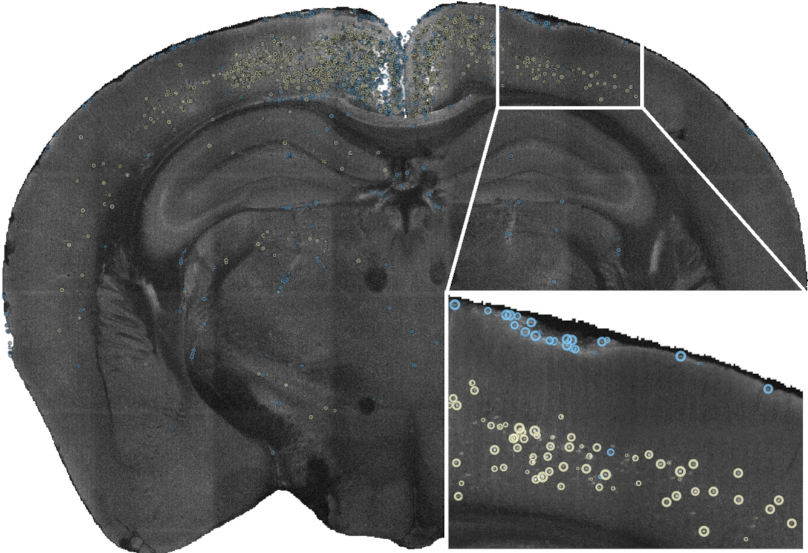{.nostretch fig-align="center" width="70%"}

{.absolute .nostretch top="4%" width="10%" right="0%"}

::: footer
[Tyson, A. L. et al. (2021) “A deep learning algorithm for 3D cell detection in whole mouse brain image datasets" PLoS Comp Biol 17(5): e1009074.](https://doi.org/10.1371/journal.pcbi.1009074)
:::

## 3D cell detection

### [`brainmapper`](https://github.com/brainglobe/brainglobe-workflows)

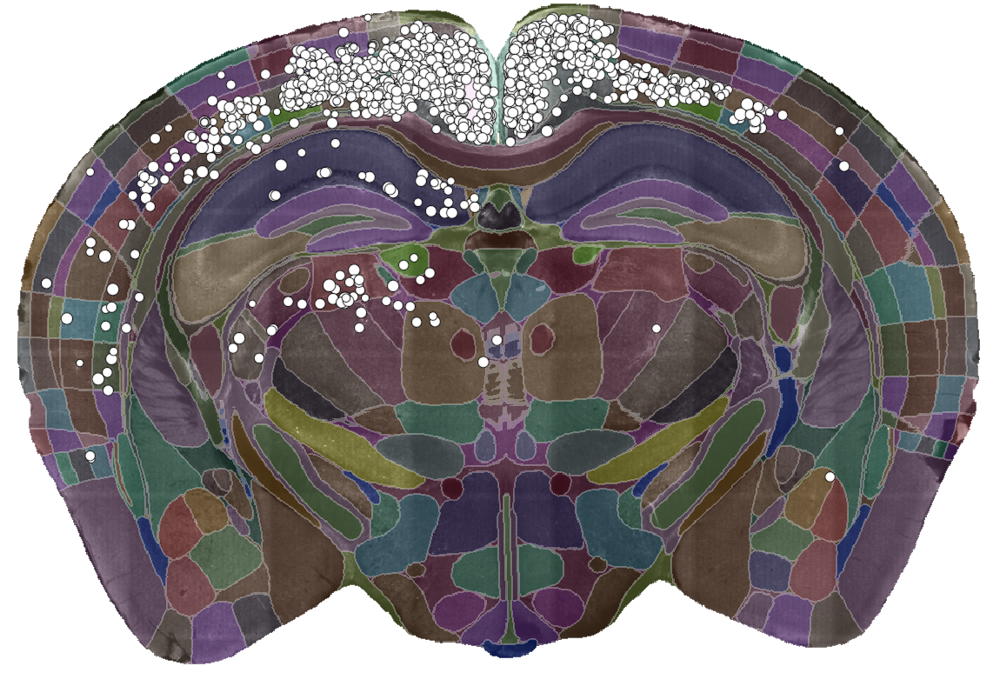{.nostretch fig-align="center" width="70%"}

{.absolute .nostretch top="4%" width="10%" right="0%"}

::: footer
[Tyson, A. L. et al. (2021) “A deep learning algorithm for 3D cell detection in whole mouse brain image datasets" PLoS Comp Biol 17(5): e1009074.](https://doi.org/10.1371/journal.pcbi.1009074)
:::

## 3D cell detection
::: {.absolute top="20%" width="90%" left="5%"}
```{python}
import itables
from IPython.display import display, HTML
import pandas as pd
data = pd.read_csv("resources/summary.csv")
cols_to_keep = data.columns[:4]
data = data[cols_to_keep]

itables.init_notebook_mode(all_interactive=True)
# show 5 rows per 'page'
itables.options.lengthMenu = [10]

# don't show the length control
itables.options.layout["topStart"] = None
itables.options.autoWidth = True

# use a smaller font (default is medium)
# see https://developer.mozilla.org/en-US/docs/Web/CSS/font-size
display(HTML("<style>.dt-container { font-size: medium; }</style>"))
itables.show(data, searching= True)
```
:::

{.absolute .nostretch top="4%" width="10%" right="0%"}

::: footer
[Tyson, A. L. et al. (2021) “A deep learning algorithm for 3D cell detection in whole mouse brain image datasets" PLoS Comp Biol 17(5): e1009074.](https://doi.org/10.1371/journal.pcbi.1009074)
:::

## Visualisation

### [`brainrender`](https://github.com/brainglobe/brainrender)

{.absolute .nostretch top="23%" width="70%" left="15%" loop="true"}

{.absolute .nostretch top="4%" width="10%" right="0%"}

::: footer
[Claudi, F. et al. (2021) “Visualizing anatomically registered data with Brainrender” eLife](https://doi.org/10.7554/eLife.65751)
:::

## BrainGlobe tools

<br/>

:::: {.columns}
::: {.column width="33%"}
{.nostretch width="40%" fig-align="center"}

::::: {style="text-align: center; font-size: 0.55em;"}
[`brainreg`](https://github.com/brainglobe/brainreg)<br/>
[`brainglobe-atlasapi`](https://github.com/brainglobe/brainglobe-atlasapi)<br/>
[`brainglobe-registration`](https://github.com/brainglobe/brainglobe-registration)<br/>
[`brainglobe-template-builder`](https://github.com/brainglobe/brainglobe-template-builder)
:::::
:::

::: {.column width="33%"}
{.nostretch width="40%" fig-align="center"}

::::: {style="text-align: center; font-size: 0.55em;"}
[`cellfinder`](https://github.com/brainglobe/cellfinder)<br/>
[`brainmapper`](https://github.com/brainglobe/brainglobe-workflows)<br/>
[`brainglobe-segmentation`](https://github.com/brainglobe/brainglobe-segmentation)
:::::
:::

::: {.column width="33%"}
{.nostretch width="40%" fig-align="center"}

::::: {style="text-align: center; font-size: 0.55em;"}
[`brainrender`](https://github.com/brainglobe/brainrender)<br/>
[`brainrender-napari`](https://github.com/brainglobe/brainrender-napari)<br/>
[`brainglobe-heatmap`](https://github.com/brainglobe/brainglobe-heatmap)
:::::
:::
::::

# brainglobe-atlasapi V3

## BrainGlobe atlases

Atlases are made up of 4 main components:

::: {.incremental}
1. Common coordinate space - text based metadata describing the coordinate system
2. Template - intensity based image of the brain
3. Annotations - per-voxel annotation and meshes for each region
4. Terminology - text based metadata linking annotations to names and parent-child relationships
:::

## `brainglobe-atlasapi` V2

::: {.incremental}
- Images stored as `.tiff` files
- Meshes stored as `.obj` files
- Distributed as a single `.tar.gz` file using [GIN](https://gin.g-node.org/)
- No reuse of data between atlases
:::

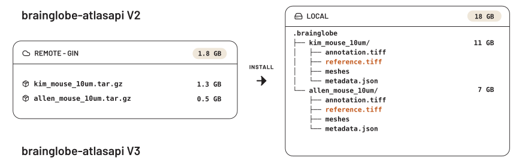{.fragment .absolute .nostretch width="75%" left="12.5%" top="55%"}

::: {style="background: #ffffffff; width: 47%; height: 10%; margin: 0px; position: absolute; top: 83%; left: 0%"}
:::

## `brainglobe-atlasapi` V3

::: {.incremental}
- Images stored as OME-Zarr files
- Meshes stored in the neuroglancer precomputed format
- Each component is downloaded when needed from [Amazon S3](https://open.quiltdata.com/b/brainglobe/tree/atlas/)
- Data is reused between atlases
:::

## `brainglobe-atlasapi` V3

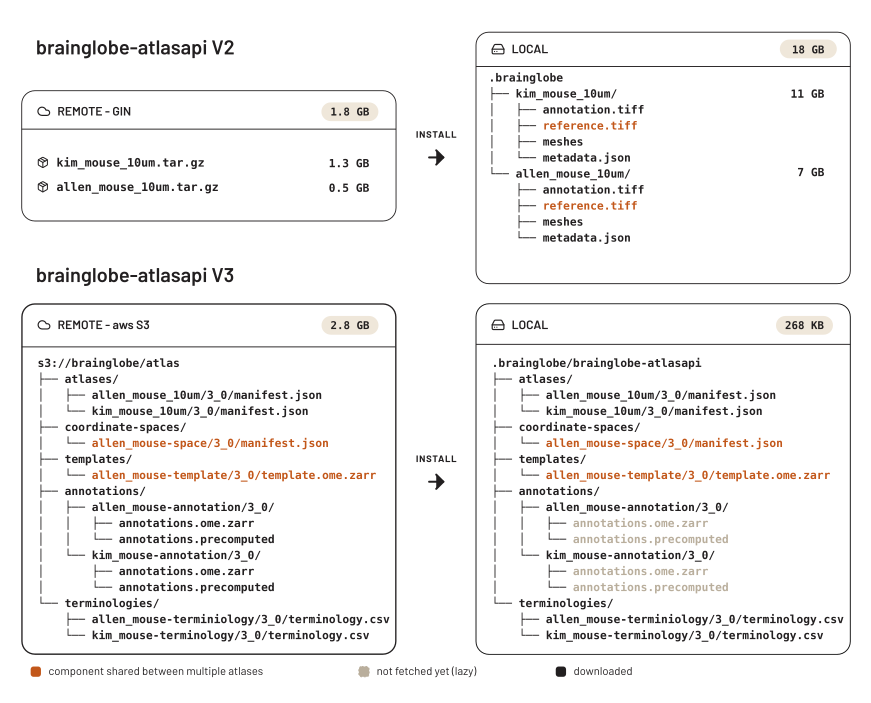{.absolute .nostretch width="70%" left="15%" top="13%"}

## Neuroglancer as a viewer for atlases

<iframe src="https://brainglobe.info/documentation/brainglobe-atlasapi/usage/atlas-details.html" title="BrainGlobe Tutorials" style="max-height: 110%; max-width: 125%; width: 125%; height: 110%; transform: scale(0.8); transform-origin: top left;"></iframe>


## Compatibility with external sources {.smaller}

```{python}
#| echo: true
#| output: true
from brainglobe_atlasapi import BrainGlobeAtlas

atlas = BrainGlobeAtlas("hmba-adult-cynomolgusmacaque-homba-atlas")

print(atlas)
```

## Compatibility with external sources {.smaller}

```{python}
#| echo: true
#| output: true
import matplotlib.pyplot as plt
import numpy as np

plane = 280

annotation_slice = atlas.annotation[plane]
annotation_masked = np.ma.masked_where(annotation_slice == 0, annotation_slice)

plt.imshow(atlas.template[plane], cmap="gray")
plt.imshow(annotation_masked, cmap="tab10", alpha=0.6)
plt.axis("off")
plt.show()
```


## Comptatibility with external sources {.smaller}

<iframe src="resources/brainrender.html" title="Brainrender" style="max-height: 110%; max-width: 125%; width: 125%; height: 110%; transform: scale(0.8); transform-origin: top left;"></iframe>

## Future directions
- More atlases!
  - Existing, and newly generated
- Improved searchability and discoverability of atlases
- Add metadata to existing atlases
- Utilise the transformations from OME-Zarr

## Acknowledgements
<br/>

::: {.columns style="font-size: 0.75em; text-align: center;"}
:::: {.column width="33%"}
Federico Claudi<br/>Luigi Petrucco<br/>Adam Tyson<br/>Troy Margrie
::::
:::: {.column width="33%"}
Tiago Branco<br/>Ruben Portugues<br/>Charly Rousseau<br/>Christian Niedworok
::::
:::: {.column width="33%"}
Mateo Vélez-Fort<br/>Alessandro Felder<br/>Nikoloz Sirmpilatze<br/>Simon Weiler
::::
:::

::: {.fragment}
{.absolute height=120px top="52%" left="10%"}
{.absolute height=112px top="76%" right="0%"}
{.absolute height=100px top="52%" right="20%"} 
{.absolute width="78%" top=76% left="0%"}
:::

## {height=70px style="margin-bottom: 0px; margin-top: 0px;"} [Contributors](https://brainglobe.info/people.html)
::: {.columns .gray_link_div style="font-size: 0.4em;"}
:::: {.column width="20%"}
[Christian Niedworok](https://github.com/cniedwor) <br/>
[Charly Rousseau](https://github.com/crousseau) <br/>
[Horst Obenhaus](https://github.com/horsto) <br/>
[Chryssanthi Tsitoura](https://github.com/chrytsi) <br/>
[Sepiedeh Keshavarzi](https://github.com/Sepidak) <br/>
[Mateo Vélez-Fort](https://github.com/velezmat) <br/>
[Stephen Lenzi](https://github.com/stephenlenzi) <br/>
[Rob Campbell](https://github.com/raacampbell) <br/>
[Alessandro Felder](https://github.com/alessandrofelder) <br/>
[Federico Claudi](https://github.com/FedeClaudi) <br/>
[Luigi Petrucco](https://github.com/vigji) <br/>
[Adam Tyson](https://github.com/adamltyson) <br/>
[Troy Margrie](https://github.com/troymargrie) <br/>
[Tiago Branco](https://github.com/ineuron) <br/>
[Ruben Portugues](https://github.com/portugueslab) <br/>
[Joe Ziminski](https://github.com/JoeZiminski) <br/>
[Sofia Miñano](https://github.com/sfmig) <br/>
[Niko Sirmpilatze](https://github.com/niksirbi) <br/>
[Nicholas Del Grosso](https://github.com/nickdelgrosso) <br/>
[Laura Porta](https://github.com/lauraporta) <br/>
[Lee Cossell](https://github.com/lcossell) <br/>
[Antonin Blot](https://github.com/ablot) <br/>
[David Pérez-Suárez](https://github.com/dpshelio) <br/>
[David Stansby](https://github.com/dstansby) <br/>
[Will Graham](https://github.com/willGraham01) <br/>
[Patrick Roddy](https://github.com/paddyroddy)
::::

:::: {.column width="20%"}
[Adrien Berchet](https://github.com/adrien-berchet) <br/>
[Mathieu Bourdenx](https://github.com/MathieuBo) <br/>
[bkntr](https://github.com/bkntr) <br/>
[NovaFae](https://github.com/novafae) <br/>
[David Young](https://github.com/yoda-vid) <br/>
[Sam Clothier](https://github.com/samclothier) <br/>
[Gubra-ApS](https://github.com/Gubra-ApS) <br/>
[Kailyn Fields](https://github.com/kailynkfields) <br/>
[ramroomh](https://github.com/ramroomh) <br/>
[Samuel Diebolt](https://github.com/sdiebolt) <br/>
[Chris Roat](https://github.com/chrisroat) <br/>
[Oren Amsalem](https://github.com/orena1) <br/>
[kclamar](https://github.com/kclamar) <br/>
[Draga Doncila Pop](https://github.com/DragaDoncila) <br/>
[juanma9613](https://github.com/juanma9613) <br/>
[Jules Scholler](https://github.com/JulesScholler) <br/>
[Iaroslavna Vasylieva](https://github.com/noisysky) <br/>
[Nicolas Peschke](https://github.com/npeschke) <br/>
[Justin Kiggins](https://github.com/neuromusic) <br/>
[Peter Sobolewski](https://github.com/psobolewskiPhD) <br/>
[Simão Bolota](https://github.com/SimaoBolota-MetaCell) <br/>
[chili-chiu](https://github.com/chili-chiu) <br/>
[jaimergp](https://github.com/jaimergp) <br/>
[Sebastian Lammers](https://github.com/seblammers) <br/>
[Matt Colligan](https://github.com/m-col) <br/>
[Paul Brodersen](https://github.com/paulbrodersen)
::::

:::: {.column width="20%"}
[Carter Peene](https://github.com/rcpeene) <br/>
[francesshei](https://github.com/francesshei) <br/>
[Sean Martin](https://github.com/seankmartin) <br/>
[Ben Dichter](https://github.com/bendichter) <br/>
[4iar](https://github.com/4iar) <br/>
[Marco Musy](https://github.com/marcomusy) <br/>
[Anna Medyukhina](https://github.com/amedyukhina) <br/>
[stegiopast](https://github.com/stegiopast) <br/>
[EmanPaoli](https://github.com/EmanPaoli) <br/>
[lidakanari](https://github.com/lidakanari) <br/>
[Alexis Arnaudon](https://github.com/arnaudon) <br/>
[Ziyang Liu](https://github.com/liu-ziyang) <br/>
[Philip Shamash](https://github.com/philshams) <br/>
[koushik-ms](https://github.com/koushik-ms) <br/>
[Harald Reingruber](https://github.com/haraldreingruber) <br/>
[Emily Jane Dennis](https://github.com/emilyjanedennis) <br/>
[Peak](https://github.com/pattarika) <br/>
[Maximilian Blacher](https://github.com/3ng7n33r) <br/>
[Hernando Martinez Vergara](https://github.com/HernandoMV) <br/>
[Estelle](https://github.com/enassar) <br/>
[nicole-vissers](https://github.com/nicole-vissers) <br/>
[GD](https://github.com/GDoumou) <br/>
[Michael Kunst](https://github.com/mkunst23) <br/>
[Estelle Nassar](https://github.com/estellenassar) <br/>
[Sara Mederos](https://github.com/SaraMederos) <br/>
[Igor Tatarnikov](https://github.com/IgorTatarnikov)
::::

:::: {.column width="20%"}
[Viktor Plattner](https://github.com/viktorpm) <br/>
[Carlo Castoldi](https://github.com/carlocastoldi) <br/>
[Jingjie Li](https://github.com/jingjie-li) <br/>
[Guillaume Le Goc](https://github.com/GuillaumeLeGoc) <br/>
[Harry Carey](https://github.com/PolarBean) <br/>
[Matt Einhorn](https://github.com/matham) <br/>
[Kimberly Meechan](https://github.com/K-Meech) <br/>
[Robert Kozol](https://github.com/Robkozol) <br/>
[Roberto](https://github.com/RobertoDF) <br/>
[Axel Bisi](https://github.com/abisi) <br/>
[Jung Woo Kim](https://github.com/kjungwoo5) <br/>
[Saima Abdus](https://github.com/saimaabdus19) <br/>
[Saarah Hussain](https://github.com/saarah815/) <br/>
[Sacha Hadaway-Andreae](https://github.com/sacha091) <br/>
[Presa](https://github.com/zenWai) <br/>
[Henry Crosswell](https://github.com/HenryCrosswell) <br/>
[Nischit Kumar](https://github.com/nischitkumar) <br/>
[Kirato Yoshihara](https://github.com/kira1228) <br/>
[Leonard Schwigon](https://orcid.org/0009-0004-1453-2638) <br/>
[Dinora Abdulazhanova](https://uol.de/ibu/neurosensorik/team/dinora-abdulazhanova) <br/>
[Katrin Haase](https://orcid.org/0000-0002-1365-2548) <br/>
[Dominik Heyers](https://orcid.org/0000-0002-2831-6985) <br/>
[Isabelle Museliak](https://orcid.org/0000-0001-7242-3123) <br/>
[Henrik Mouritsen](https://orcid.org/0000-0001-7082-4839) <br/>
[Simon Weiler](https://github.com/simonweiler) <br/>
[Stella Prins](https://github.com/stellaprins)
::::

:::: {.column width="20%"}
[Richard Dushime](https://github.com/richarddushime) <br/>
[Miguel Xochicale](https://github.com/mxochicale) <br/>
[M S P](https://github.com/msp99000) <br/>
[Abdul Samad](https://github.com/samadpls) <br/>
[Prisha Sharma](https://github.com/parharti) <br/>
[Farida Yusuf](https://github.com/frdysf) <br/>
[Anshu Saini](https://github.com/0Anshu1) <br/>
[Menna1812](https://github.com/Menna1812) <br/>
[ayush2281](https://github.com/ayush2281) <br/>
[BethCr](https://github.com/BethCr) <br/>
[Swapnaneel Patra](https://github.com/thisisrick25) <br/>
[Xiaoyu Deng](https://github.com/X-Deng) <br/>
[DwarvesEatRocks](https://github.com/DwarvesEatRocks) <br/>
[DPWebster](https://github.com/DPWebster) <br/>
[Conrad](https://github.com/conradRz) <br/>
[pranav33317](https://github.com/pranav33317) <br/>
[Biswanath Saha](https://github.com/Elsword016) <br/>
[Federico F.](https://github.com/Fede2717) <br/>
[Tim Monko](https://github.com/TimMonko) <br/>
[Kaixiang Shuai](https://github.com/Skxsmy) <br/>
[Giulia Paci](https://github.com/giuliapaci) <br/>
[Marco Dalla Vecchia](https://github.com/marcodallavecchia) <br/>
[Pavel Vychyk](https://github.com/p-vychik) <br/>
[Ishrat Zaman](https://github.com/ishratz25) <br/>
[Asma Bashir](https://github.com/DrABashir) <br/>
[Fatma S. Elsharkawy](https://github.com/FatmaElsharkawy)
::::
:::

::: {.footer}
[https://brainglobe.info/people.html](https://brainglobe.info/people.html)
:::


